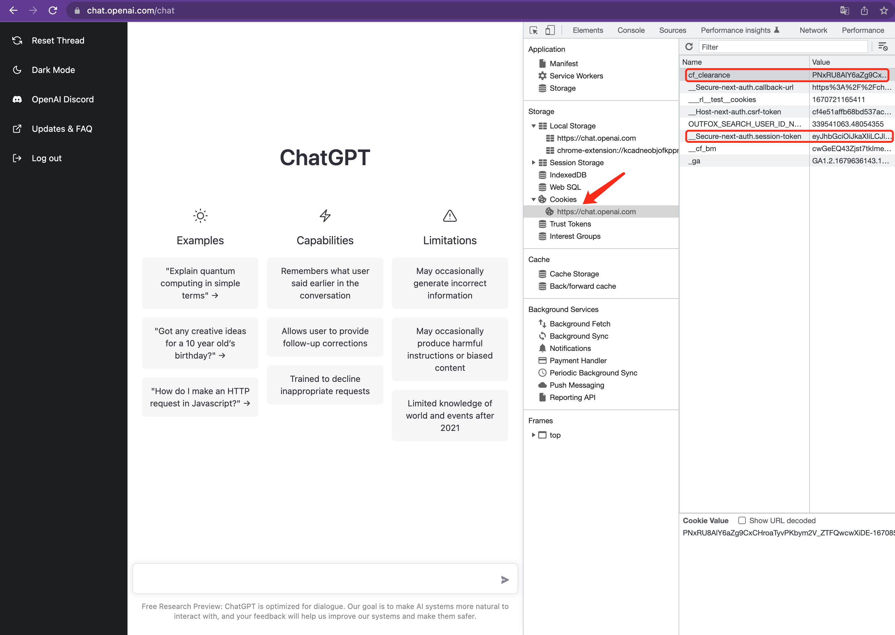
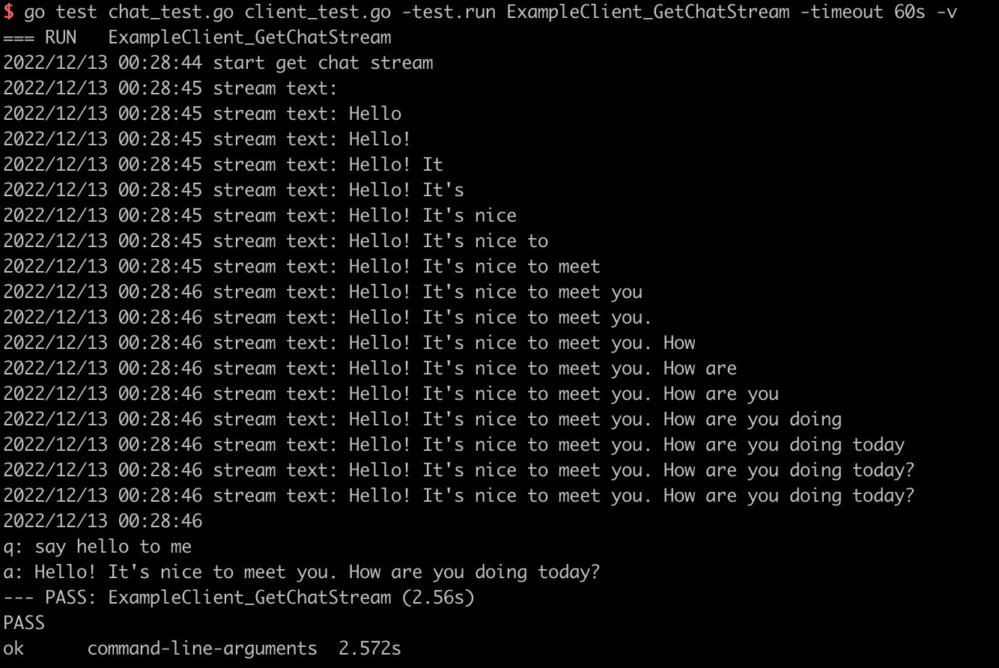

> if you want to use [GPT-3](https://beta.openai.com/docs/api-reference/introduction) apis, look at this one: [GPT-3 SDK](https://github.com/chatgp/gpt3),

# chatgpt-go

chatgpt sdk writen by golang.

## Preparation

you should login into the [ChatGPT Website](https://chat.openai.com/chat) firstly, find the Cookies named `cf_clearance`,`__Secure-next-auth.session-token`, and copy their values.



> `_puid` cookie is required too, while only plus user can find it in their cookies after login ChatGPT official website.

## Quick Start

1. install chatgpt-go sdk

```shell
go get -u github.com/chatgp/chatgpt-go
```

2. chat in independent conversation

```go
package main

import (
	"log"
	"net/http"
	"time"

	chatgpt "github.com/chatgp/chatgpt-go"
)

func main() {
	token := `copy-from-cookies`
	cfValue := "copy-from-cookies"
	puid := "copy-from-cookies"

	cookies := []*http.Cookie{
		{
			Name:  "__Secure-next-auth.session-token",
			Value: token,
		},
		{
			Name:  "cf_clearance",
			Value: cfValue,
		},
		{
			Name:  "_puid",
			Value: puid,
		},
	}

	cli := chatgpt.NewClient(
		chatgpt.WithDebug(true),
		chatgpt.WithTimeout(60*time.Second),
		chatgpt.WithCookies(cookies),
	)

	// chat in independent conversation
	message := "say hello to me"
	text, err := cli.GetChatText(message)
	if err != nil {
		log.Fatalf("get chat text failed: %v", err)
	}

	log.Printf("q: %s, a: %s\n", message, text.Content)
}
```

3. chat in continuous conversation

```go
package main

import (
	"log"
	"net/http"
	"time"

	chatgpt "github.com/chatgp/chatgpt-go"
)

func main() {
	// new chatgpt client
	token := `copy-from-cookies`
	cfValue := "copy-from-cookies"

	cookies := []*http.Cookie{
		{
			Name:  "__Secure-next-auth.session-token",
			Value: token,
		},
		{
			Name:  "cf_clearance",
			Value: cfValue,
		},
	}

	cli := chatgpt.NewClient(
		chatgpt.WithDebug(true),
		chatgpt.WithTimeout(60*time.Second),
		chatgpt.WithCookies(cookies),
	)

	// chat in continuous conversation

	// first message
	message := "say hello to me"
	text, err := cli.GetChatText(message)
	if err != nil {
		log.Fatalf("get chat text failed: %v", err)
	}

	log.Printf("q: %s, a: %s\n", message, text.Content)

	// continue conversation with new message
	conversationID := text.ConversationID
	parentMessage := text.MessageID
	newMessage := "again"

	newText, err := cli.GetChatText(newMessage, conversationID, parentMessage)
	if err != nil {
		log.Fatalf("get chat text failed: %v", err)
	}

	log.Printf("q: %s, a: %s\n", newMessage, newText.Content)
}
```

> if you want to start a new conversation out of current conversation, you don't need to reset the client. just remove the `conversationID`、`parentMessage` arguments in `GetChatText` method and use it to get a new text reply.

4. get chat content with stream

```go
package main

import (
	"log"
	"net/http"
	"time"

	chatgpt "github.com/chatgp/chatgpt-go"
)

func main() {
	// new chatgpt client
	token := `copy-from-cookies`
	cfValue := "copy-from-cookies"

	cookies := []*http.Cookie{
		{
			Name:  "__Secure-next-auth.session-token",
			Value: token,
		},
		{
			Name:  "cf_clearance",
			Value: cfValue,
		},
	}

	cli := chatgpt.NewClient(
		chatgpt.WithDebug(true),
		chatgpt.WithTimeout(60*time.Second),
		chatgpt.WithCookies(cookies),
	)

	message := "say hello to me"
	stream, err := cli.GetChatStream(message)
	if err != nil {
		log.Fatalf("get chat stream failed: %v\n", err)
	}

	var answer string
	for text := range stream.Stream {
		log.Printf("stream text: %s\n", text.Content)
		answer = text.Content
	}

	if stream.Err != nil {
		log.Fatalf("stream closed with error: %v\n", stream.Err)
	}

	log.Printf("q: %s, a: %s\n", message, answer)
}
```

## Tests

under examples folder there are some tests, execute `go test` command and get outputs like below:

- get chat text


- get chat text in continuous conversation


- get chat text from stream



#
**Author:** [Dmitrii Kumancev](https://github.com/DmitriiKumancev)